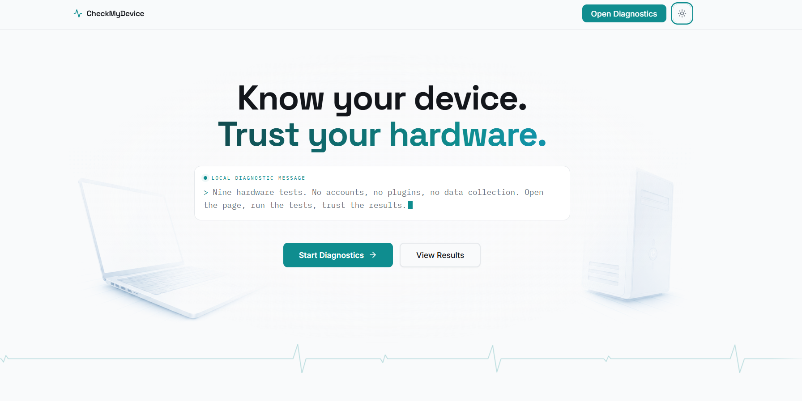
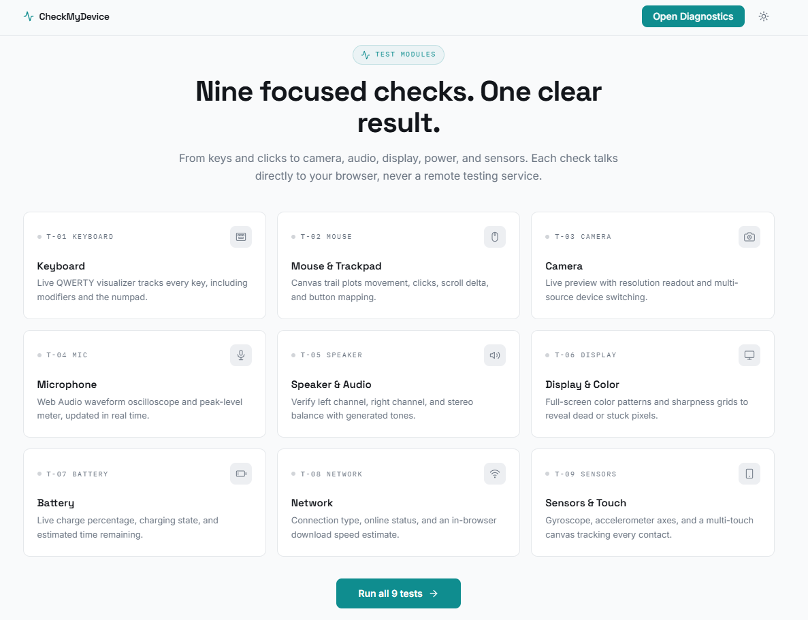

# CheckMyDevice

### Nine hardware checks. One browser tab. Nothing uploaded.

Buying a device, troubleshooting a peripheral, or checking a repair should not require installing a mystery utility. CheckMyDevice turns a modern browser into a focused diagnostic bench for the keyboard, mouse or trackpad, camera, microphone, speakers, display, battery, network, and sensors.

Every diagnostic is guided, responsive, and privacy-first. Hardware readings are processed in the current browser tab, protected access is requested only when needed, and test statuses stay in that browser's `localStorage`. There is no account, application download, browser extension, analytics tracker, or diagnostic database.

**Deployed domain:** [https://checkmydevice.vercel.app/](https://checkmydevice.vercel.app/) | [Explore the diagnostics](#diagnostic-modules) | [Read the privacy model](#privacy-model)




## Why CheckMyDevice

- **Nine focused diagnostics:** Test keyboard, mouse or trackpad, camera, microphone, speakers, display, battery, network, and device sensors.
- **Privacy-first execution:** Camera previews, microphone samples, key events, pointer events, and sensor readings are not uploaded to an application server.
- **Permission-aware:** Camera, microphone, mouse, battery, network, and sensor tests start only after a deliberate user action.
- **Useful live evidence:** Each test provides responsive metrics, visual feedback, and a clear working, issue, unsupported, or untested result.
- **No installation:** Run the suite from a modern browser on localhost or HTTPS.
- **No account or tracking:** The shipped frontend has no authentication, analytics, advertising SDK, cookies, or remote diagnostic service.
- **Responsive interface:** The diagnostic workspace supports desktop, tablet, and mobile layouts, plus light and dark themes.

## Diagnostic modules



| ID | Test | What it verifies |
| --- | --- | --- |
| T-01 | Keyboard | Selectable layouts from full-size through 40% mini plus a Mac layout, with function-row, navigation, modifier, arrow, and numpad coverage where that layout includes them. Operating-system-reserved keys are identified honestly. |
| T-02 | Mouse & Trackpad | Pointer movement, primary and secondary clicks, middle click, and scrolling inside an explicitly started test surface. |
| T-03 | Camera | User-selected camera source, live local preview, stream state, aspect ratio, and reported resolution. A visible Stop Camera control releases the active stream. |
| T-04 | Microphone | Live waveform, current level, peak level, and a five-second playback sample held temporarily in tab memory. |
| T-05 | Speaker | Left, right, and stereo output, real-time test volume, frequency sweep, reference melody, and reference chord. Audio is generated locally with the Web Audio API. |
| T-06 | Display | Solid colors, black and white, gradient banding, sharpness grid, and checkerboard rendering in an optional fullscreen inspection view. |
| T-07 | Battery | Browser-reported charge level, charging state, time estimate, live events, and one-second telemetry checks when the Battery API is available. |
| T-08 | Network | Online state, external reachability, latency, jitter, and sustained download throughput measured against Cloudflare's speed-test endpoint. |
| T-09 | Sensors | Device orientation, acceleration, and multi-touch input after the user starts the test. Unsupported readings remain `N/A`. |

The dashboard tracks each module as `untested`, `working`, `issue`, or `unsupported`. The report page summarizes all nine results locally.

## Privacy model

CheckMyDevice is designed around data minimization.

| Data or capability | Handling |
| --- | --- |
| Camera | The live `MediaStream` is attached only to the local preview element. It is not recorded or uploaded. The stream is stopped when requested or when the test page exits. |
| Microphone | The first five seconds are stored as a temporary in-memory Blob URL for local playback. The sample is revoked when replaced or when the page exits. It is never written to `localStorage`. |
| Keyboard and mouse | Browser events are evaluated in the active test page. Raw event histories are not sent to a server. |
| Speaker | Test tones are synthesized locally. No remote audio file is required. |
| Display, battery, and sensors | Readings and interactions remain in component memory. Only the final test status is persisted. |
| Test results | Status values are validated and saved under `checkmydevice-results` in `localStorage`. They are not synchronized. |
| Network test | Starts only after a click and may download up to 100 MB from Cloudflare. It first connects directly, then uses a fixed-size same-site Vercel relay if a browser or privacy shield blocks the cross-origin stream. No downloaded file is retained. Cloudflare and, when the relay is used, Vercel receive the normal metadata associated with those requests. |
| Fonts | The current build requests font styles and files from Google Fonts. No hardware diagnostic readings are included in those requests. |

Camera and microphone permission duration is controlled by the browser. A browser may remember a previous decision for the site. Reset All clears CheckMyDevice's saved result statuses, but websites cannot revoke browser permissions programmatically. Users can review or revoke remembered permissions from the browser's site settings.

## Security controls

The included Vercel configuration applies production response headers that:

- restrict executable scripts and outbound connections with Content Security Policy;
- allow camera, microphone, motion sensors, and fullscreen only for the application itself;
- disable unused capabilities such as geolocation, display capture, USB, serial, HID, payment, and local-network access;
- prevent the application from being embedded in another site, reducing clickjacking risk;
- enforce HTTPS, MIME-type protection, origin isolation, and a no-referrer policy.

Protected media requests are cancelled when their page exits. The project also preserves pnpm's `minimumReleaseAge: 1440` setting as a supply-chain safeguard.

No public web application can promise absolute security. Please report a suspected vulnerability privately through a [GitHub Security Advisory](https://github.com/yuan05-afk/CheckMyDevice/security/advisories/new). Do not include sensitive findings in a public issue.

## Browser requirements and limitations

- Use a current version of Chrome, Edge, Firefox, or Safari.
- Camera, microphone, and several sensor APIs require HTTPS or localhost.
- Browser, operating-system, and hardware support varies. `unsupported` is a valid diagnostic result.
- Laptop `Fn` keys are commonly handled by firmware and may not emit a browser keyboard event.
- Operating-system shortcuts such as the Windows key or Print Screen may be intercepted before the browser receives them.
- Battery and Network Information APIs are not exposed by every browser and may report limited or approximate values.
- Hardware diagnostics can indicate browser-observable behavior, but they cannot replace manufacturer service tools or electrical testing equipment.

## Run locally

### Prerequisites

- Node.js 22.12 or newer
- pnpm 10.34.4 or a compatible pnpm 10 release

This workspace intentionally rejects npm and Yarn.

### Clone, install, and start

Clone the repository, then install and start the application:

```sh
git clone https://github.com/yuan05-afk/CheckMyDevice.git
cd CheckMyDevice
pnpm install --frozen-lockfile
pnpm dev
```

Open `http://localhost:5173`.

The development server defaults to port `5173`. Override it only when needed.

PowerShell:

```powershell
$env:PORT = '4173'
pnpm dev
```

POSIX shell:

```sh
PORT=4173 pnpm dev
```

## Quality checks

Validate the local application with:

```sh
pnpm --filter @workspace/check-my-device run typecheck
pnpm --filter @workspace/check-my-device run build
```

The equivalent root product build is:

```sh
pnpm run build:app
```

Production output is written to `artifacts/check-my-device/dist/public/`.

The root `pnpm run build` also checks workspace scaffolds that are not part of the shipped application. For product-only work, prefer the filtered frontend commands above.

## Technology

- React 19 and TypeScript
- Vite 7
- Tailwind CSS 4
- shadcn/ui and Radix UI primitives
- Framer Motion
- Wouter
- Web APIs including MediaDevices, MediaRecorder, Web Audio, Fullscreen, Battery Status, Network Information, Device Orientation, Device Motion, and Touch Events

## License

This project is licensed under the MIT License.

<sub>Created by Yuan Mariano.</sub>
